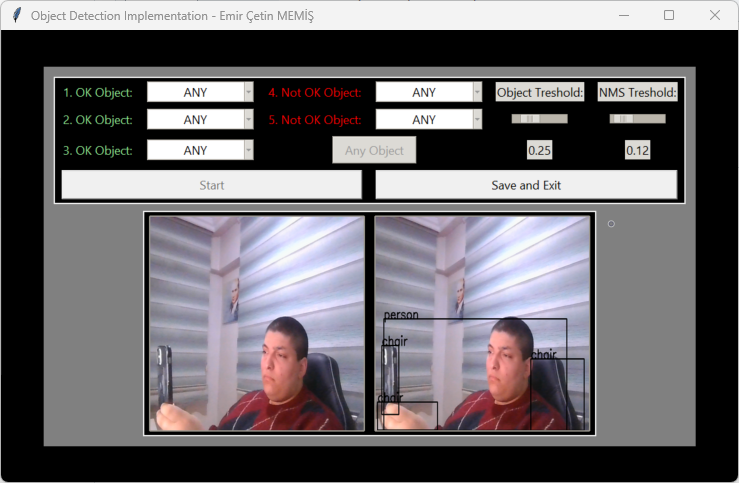

# An basic Object-Detection application for practicing. 

> First of all, this is a kind of odp application that uses coco set, and its set for learning and experience.

* This application eliminates a set of given elements from a serial video resource. You can directly set some classes and qualifications for filtering options also, there also exixst an sql output for schemes.

# SETUP - You can directly use requirements.txt to set up your environment.
* `conda create -n odp python=3.9 ; conda activate odp ; pip install -r requirements.txt`

# USAGE - You can directly execute the application with the installed environment.
* `conda activate odp ; python main.py`

# Example Execution

